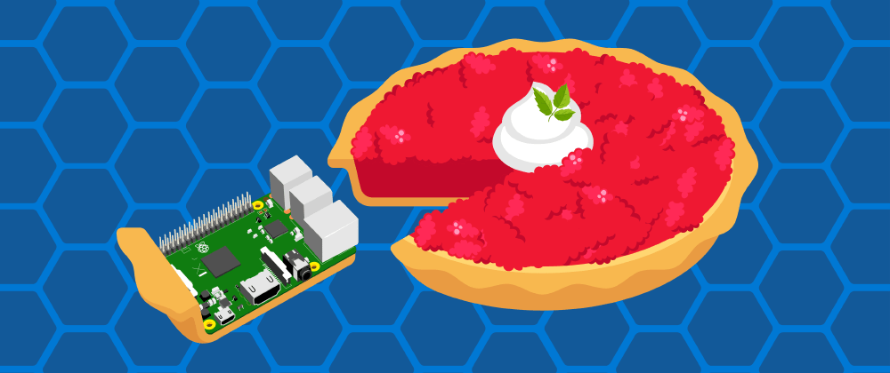
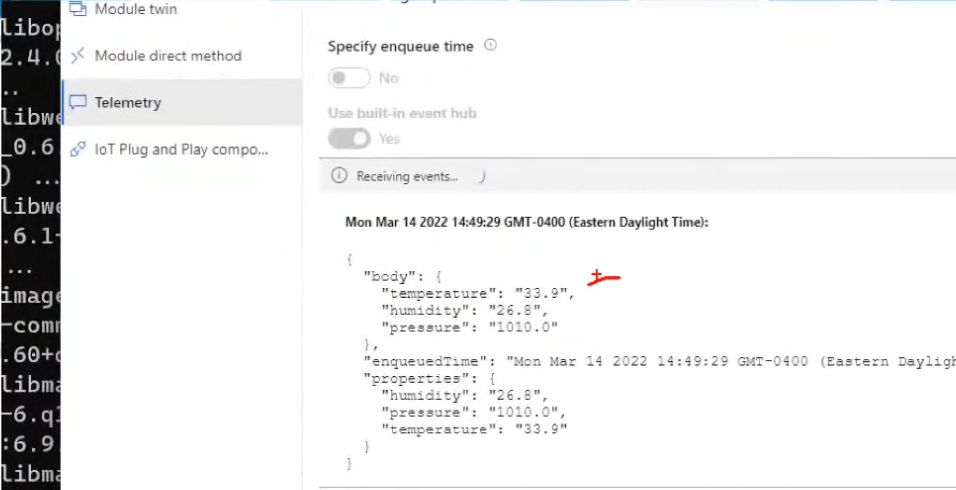

# Custom Azure IoT ☁️ Edge Module for a Raspberry Pi using a Sense Hat

3/14, or the 14th of March is Pi day (apologies to everyone outside the US who uses DD/MM date formats...)! The best thing to celebrate Pi day with is, well, Pie.

The second best thing to celebrate Pi day with is the Raspberry Pi, one of our favorite IoT devices. At the Microsoft Reactor we celebrated with a [set of streams focusing on IoT built using a Raspberry Pi](https://dev.to/azure/pi-day-is-coming-to-the-microsoft-reactor-5chd). 

In one of these sessions I shared how to do a live setup of a Raspberry Pi as a new Azure IoT Edge. The Azure IoT Edge runtime is what turns a device into an IoT Edge device. Once a device is configured with the IoT Edge runtime, you can start deploying business logic to it from the Azure IoT Hub.

And for the final demo of this session, I used a SenseHat to:

>> - Display a message on the Pi's LED screen, using the SenseHat's built-in LED matrix. 

## What is a Sense HAT?

The Sense HAT is an add-on board for the Raspberry Pi, made especially for the Astro Pi competition. The board allows you to make measurements of temperature, humidity, pressure, and orientation, and to output information using its built-in LED matrix.

>> If you want to know more about

If you don’t have access to a Sense HAT, you can use the emulator. There is an online emulator you can use in your browser to write and test code for the Sense HAT.

[Online Sense HAT emulator](https://trinket.io/sense-hat)

- Open an internet browser, go to https://trinket.io/sense-hat and delete the existing demo code which is in the editor.

- If you would like to save your work, you will need to create a free account on the Trinket website.

## Creating an Azure IoT Edge Module

The main development tools for this scenario are 
- Visual Studio Code, available from 
- Visual Studio Code for Azure IoT, available from 

The sample code for the Azure IoT Edge 

## Testing the sample

Once the SenseHat module is deployed to the Azure IoT Edge device, we can start to check the device telemetry and also to update the device twin information to display messages on the led display. 

You can use the [Azure IoT Explorer](https://github.com/Azure/azure-iot-explorer/releases) to test that your SenseHat is properly working.

### Update device twin to show a message

### Check device telemetry 

## Additional Resources

You can check a session recording about this topic in English and Spanish.

- Eng - [Let's setup a Raspberry Pi as an Azure IoT ☁️ device (Part1)](https://aka.ms/PiDayPart1)
- Spa - [Coming soon](aka.ms/PiDayPart1)

In my personal blog "[ElBruno.com](https://elbruno.com)", I wrote about several scenarios on how to work and code for the Raspberry Pi and Azure IoT ☁️. These links may help to understand specific implementations of the sample code:

- [AzureIoT – Using a Raspberry Pi Grove Sensor 👀 in an ☁ Azure IoT Edge Module – Full Series](https://elbruno.com/2021/08/26/azureiot-using-a-raspberry-pi-grove-sensor-in-an-%e2%98%81-azure-iot-edge-module-full-series/)
- [RaspberryPi – Install ☁ Azure IoT Edge in a Raspberry Pi with Ubuntu 18.04, lessons learned and some tips](https://elbruno.com/2021/02/10/raspberrypi-install-%e2%98%81-azure-iot-edge-in-a-raspberry-pi-with-ubuntu-18-04-lessons-learned/)
- [AzureIoT – Granting access to Raspberry Pi GPIO from an ☁ Azure IoT Edge Module](https://elbruno.com/2021/03/04/azureiot-granting-access-to-raspberry-pi-gpio-from-an-%e2%98%81-azure-iot-edge-module/)
- [RaspberryPi – Build #docker 🐳 images from Visual Studio Code remotely using a Raspberry Pi. AzureIoT](https://elbruno.com/2021/02/03/raspberrypi-build-docker-%f0%9f%90%b3-images-from-visual-studio-code-remotely-using-a-raspberry-pi-azureiot/)

## Author

👤 **Bruno Capuano**

* Website: https://elbruno.com
* Twitter: [@elbruno](https://twitter.com/elbruno)
* Github: [@elbruno](https://github.com/elbruno)
* LinkedIn: [@elbruno](https://linkedin.com/in/elbruno)

## 🤝 Contributing

Contributions, issues and feature requests are welcome!

Feel free to check [issues page](https://github.com/elbruno/AzureIoTRpiSenseHat/issues).

## Show your support

Give a ⭐️ if this project helped you!

## 📝 License

Copyright &copy; 2021 [Bruno Capuano](https://github.com/elbruno).

This project is [MIT](/LICENSE) licensed.

***